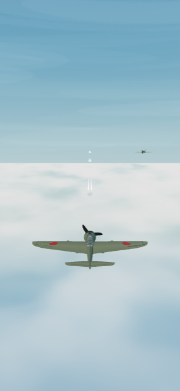
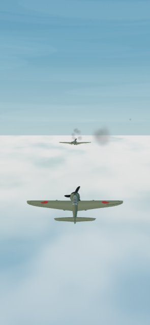
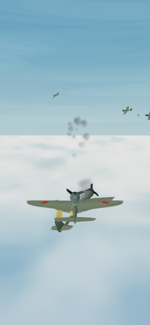
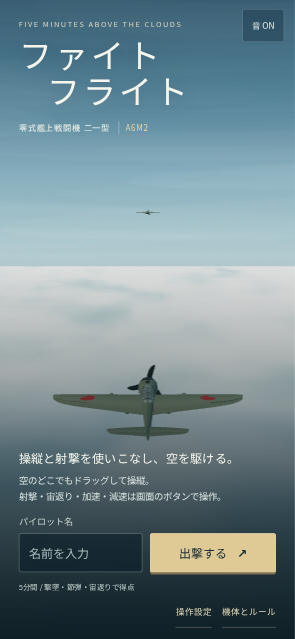
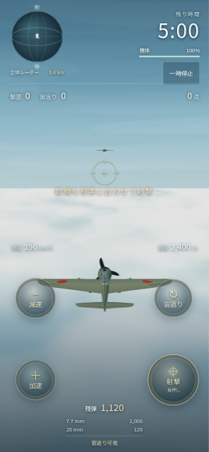
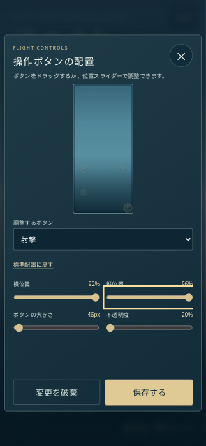
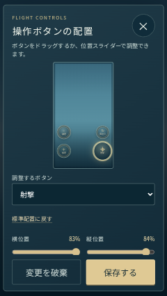
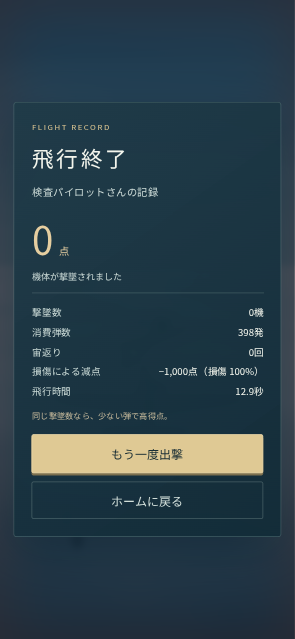

# 操作・損傷改修の検査記録

実施日：2026-09-28。対象基点は `main` = `6feac27a6a4a4c5e1a536745fd7b19908493f195`。初回実装の検査結果を改修後の合格として流用していない。対象ファイルのSHA-256は `docs/evidence/source-hashes.json` に記録する。

## 実行結果

| 検査 | 結果と条件 |
| --- | --- |
| 本体 `npm test` | 15件成功。300秒、被弾の実HPだけを減点、過剰ダメージ・同一撃墜の二重計上防止、敵の70/50/30%速度段階、加減速、減速旋回、追手を前へ出す宙返り、弾数・銃口・命中、5秒の墜落・停止・終了後固定、終了優先順・再現性 |
| `npm run build` | TypeScriptと本番ビルド成功。JS約649kB、gzip約168kB。500kB超のチャンク警告は残る |
| 4ボタンの設定 | 各ボタンをサイズ46px・不透明度20%へ変更して保存。端の位置へ変更、未保存変更の破棄、再読込後の保存値維持をUIで確認 |
| 同時入力 | CDPの実タッチ接点でスティック＋射撃。操縦側のpointercancel後も残る射撃指は継続し、全指解放で射撃が停止 |
| 飛行操作 | 加速時の速度上昇、減速時の速度低下、専用ボタンから宙返り1回・150点を確認。上向きスティック操作だけでは宙返りしない |
| 停止・設定 | 一時停止から操作設定を開閉してもゲーム時間不変、明示的な再開で飛行継続、blurで一時停止、ホームへ戻る |
| 結果・再出撃 | 実射撃操作で12.85秒・398発後に被撃墜。被害100%・減点1,000点と結果の値が一致。320×568でも結果からホームへ戻れ、再出撃で弾数・得点・損傷を初期化 |
| 表示サイズ | 393×852、320×568、393×650、852×393 CSS px。横はみ出しなし、開始・設定保存ボタンの44px以上の高さと到達性を確認。ホームの文字200%でも開始可能 |
| 描画資源 | 初期78 geometry / 8 textures、弾・炎煙を使った後84 / 10、再出撃84 / 10。ページ例外・シェーダーエラー0件 |

画面通し検査：Chromium 153.0.8010.0 / Linux / SwiftShader、タッチ有効。CSS寸法を維持し、描画負荷を減らしたDPR 0.75で実施。初回に描画が1秒以上止まったため一時停止を1回観測し、停止理由を確認した上でUIの再開ボタンから続行した。本体の停止基準を無効化していない。DPR 1ではスティックの初回表示にも描画停止を観測し、通し検査は完走できなかった。この結果をiPhone実GPUの性能不良／合格とは扱わない。

画面取得時、ゲーム内の重複説明文がレーダー・時間表示に重なることを見つけ、同じ説明がホームにあるためゲーム画面の1行だけを削除した。操作検査後のこの変更は入力・判定を変えない。更新後の通常ゲームの飛行画像で重なりの解消を再確認した。

生の操作記録は [browser-check.json](evidence/browser-check.json)、再実行は `scripts/browser-check.cjs`。テストブラウザ内の設定値は検査のためだけに保存し、利用者のブラウザ保存には触れていない。開発用の読取スナップショットを使い、通常ゲームへ状態・得点を注入していない。

```sh
START_TEST_SERVER=1 BROWSER_DPR=0.75 BROWSER_EXECUTABLE=/path/to/chromium node scripts/browser-check.cjs
```

## 弾道・炎煙の最終確認

`src/scene.ts` のインスタンス色と頂点色の取り扱いを修正し、実弾6発の軌跡を画像で確認。近距離・遠距離の軌跡幅を調整し、炎は明るい空で白飛びしない通常の透明ブレンドにした。損傷煙は30%以下で毎秒8〜12個の固定プールから発生する。

独立した検査ページ `scripts/vfx-check.cjs` から実際の描画・本体モジュールを読み込み、以下を確認した。検査のため配置とHPを固定したfixtureであり、通常ゲームの操作検査とは区別する。

- HP30%の煙が見え、一時停止で煙の個数と各粒子の経過時間が変わらない。
- 実射撃による撃墜後、結果状態でも墜落時刻0.5／2.4／4.4秒で炎と煙を継続。5秒経過後は墜落モデルを除去し、炎は消え、残る煙が減衰する。
- 再初期化で炎・煙・墜落モデルが0になり、84 geometry / 10 texturesを超えて増加しない。ページ例外・シェーダーエラー0件。
- fixtureを閉じて通常ゲームを起動し、入力注入なしでホームから出撃。HUDの重なり解消を確認。

最終fixtureはChromium 153.0.8010.0／SwiftShader／393×852 CSS px／DPR 0.75。記録は [vfx-check.json](evidence/vfx-check.json)。最後の描画変更後に `npm test` 15件と本番ビルドを再実行して成功。通常操作の通し検査以降に変更したのは描画の可視性・説明文と検査fixtureだけで、入力・採点・本体更新は変更していない。

```sh
BROWSER_DPR=0.75 BROWSER_EXECUTABLE=/path/to/chromium node scripts/vfx-check.cjs
```

| 弾道 | 損傷煙 | 炎を伴う墜落 |
| --- | --- | --- |
|  |  |  |

## 確認画像

| ホーム | 飛行 |
| --- | --- |
|  |  |

| 設定 | 短い画面の設定 | 結果 |
| --- | --- | --- |
|  |  |  |

## 独立レビュー

利用者指定に従いSol Highの別担当が完成版を読取レビューした。得点・終了・損傷・宙返り・設定保存・多指入力・停止・資源解放を確認。終了画面へ切り替わると墜落機の炎煙が止まる不整合を修正し、再レビューでは新しい重大な不整合は指摘されなかった。元のモデルの銃口と発射起点も揃えた。最後のインスタンス色・距離に応じた弾道幅の差分も独立レビューを実施し、重大な不整合・過大描画なし。その後の炎の通常透明ブレンドへの変更は主担当がfixtureの画像で再確認した。コードレビューと実際の操作感の採用判断は別である。

## 未確認と限界

- iPhone実機Safari、実GPUでの滑らかさ、発熱・電池、音の実聴・電話着信からの復帰、VoiceOverの通し操作は未確認。
- 300秒終了・弾切れ終了は単体検査で確認。ブラウザ通し検査の終了理由は被撃墜であり、5分間生存する実時間の通し操作ではない。
- 機体形状・飛行性能・敵行動・減点10点/HP・操作補助は資料を参考にしたゲーム用表現。精密スキャン、厳密な空力、実機録音ではない。画質と操作感は利用者による実機試遊で調整する。
- 公開ページ確認用のクラウドブラウザはWebGLが無効で、3D起動を確認できない。公開版の配備・HTMLと資源の照合、本検査環境の3D動作、実機試遊を区別する。

## 提出と公開

GitHubのChecksはローカル検査と別の証拠としてPRに表示する。作業ブランチ＋Draft PRへ提出し、mainは直接変更・マージしない。利用者の実機確認用公開の許可に基づき、同じソースから作った成果物を既存gh-pagesへ反映する。`deployment.json` でソースコミット、公開前の成果物ハッシュを結ぶ。旧版の資源を残して混在キャッシュに備え、Service Workerは導入しない。

書込前にR12でrepo/base/head/pathを照合する。枝情報`protected:false`と保護詳細APIの403、rulesetsの取得結果を区別し、403を保護不存在と扱わない。
