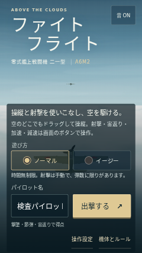
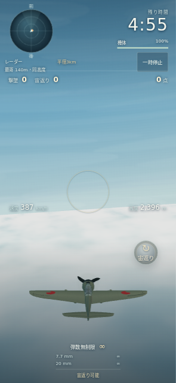
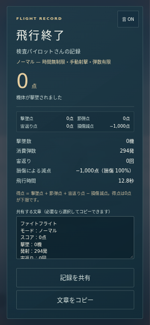

# モード・飛行・共有改修の検査記録

実施日：2026-09-29。基点 `main` = `536f26f48d477df9e68cda87a639ba866d10f5da`。前回の検査記録はGit履歴に残し、今回の合格として流用していない。17項目の受入条件は [SPEC.md](SPEC.md)、独立レビューは [REVIEW_MODES.md](REVIEW_MODES.md)。

## 自動検査

- `npm test`：37件成功。既存の弾道・得点・損傷・墜落・停止・入力再現性に加え、イージー300秒／ノーマル時間無制限、無限弾数・自動射撃、射程と実カメラの円内判定、補助の消失と反対操作、バンク中の補正、画面外での最大入力の旋回強化、65m/sの宙返り、上昇角、両モードの最後の敵撃墜3秒後の補充と停止／14秒の通常出撃との重複防止を検査。
- レーダーは水平距離・方位・高度差、ピッチとバンクへの独立性、範囲外接点、撃墜機の除外を検査。投影式はThree.jsの実カメラと比較し、縦／横／正方形、複数ピッチ、円の両軸境界、背後・遠方を照合。
- 共有の文章・モード・小数1桁の時間・URL直書き、共有の取消しと非対応、明示的なコピーの成功／失敗を検査。外部SNSへの投稿は行わない。
- 音は偽のWeb Audioコンテキストで、命中／被弾の異なる周波数と音源構成、所有者・イベント重複、間隔制限、10音源上限と被弾用3枠、終了余韻、消音／再出撃後の停止と解放を検査。これはスケジュールと資源管理の検査であり、実聴ではない。
- `npm run build`：TypeScript・Vite成功。JS約667kB、gzip約174kB。既存同様、500kB超のチャンク警告は残る。
- `git diff --check`：成功。作業ツリーとGitHub treeの内容一致を照合してコードを保存。

## 独立レビュー

Sol Highの別担当がコード・テスト・共有画像を確認し、3件を指摘。最大入力で旋回倍率が消える処理、結果直後の音が非表示時に止まらない経路、一時停止中の設定保存が別モードの値も再書込みする処理を修正した。画面操作担当が発見した射撃の指を離した際の結果ボタン誤操作と、主担当が発見したホームの被弾表示残留も修正し、独立担当が差分を再確認した。重大な未解決の指摘はなく、別担当自身も37件のテスト・ビルド・差分チェックを再実行して成功。発見者、コードレビュー、画面検査は [REVIEW_MODES.md](REVIEW_MODES.md) で区別する。

## 画面操作の検査

Chromium 153.0.8010.0 / Linux / SwiftShader、タッチ入力の模擬端末、DPR 0.75で実行。393×852、320×568、852×393と文字200%を確認し、日本語フォントを用意した環境で画像を目視した。iPhone実機ではない。

- [通し検査記録](evidence/modes-check.json)：モード選択、時計、イージーの自動射撃と無限弾数・宙返りのみの操作ボタン、画面の短辺に一致する円、ノーマルの手動射撃を確認。ホーム・結果では両モード設定、停止中は現在モードのみ、個別保存・取消し・再読み込みと停止中の時間凍結を確認した。
- 実際のタッチ操作で操縦と射撃を行い、通常の被撃墜で結果へ進んだ。結果のスクロール、再出撃、ホームリンクを確認。小画面では結果のスクロール位置0→200と、表示されたホームボタンへのタップを記録した。
- 射撃中の指を保持したまま結果に進む再現で、古い指から結果の共有ボタンへ信頼済みclickが届いた。修正後は、指を離す前後とも共有呼出し0回、新しい明示的タップ後のみ1回。共有境界を差し替え、確定結果とURLを含む引数を確認した。OSの共有シートを開いた証拠やSNS投稿ではない。
- 通し検査中に描画停止を検出して自動停止した1回は、表示を確認して画面の再開操作で戻した。自動停止の保護は無効化していない。ページ例外・コンソールエラーは0件。
- [表示リセットの限定再検査](evidence/modes-cues-check.json)：自然な被撃墜後の結果→ホーム→次の出撃で、被弾縁取りの不透明度は0、旧通知は空、ページ例外0件。通し検査後の表示リセット修正に絞った検査であり、通し検査の再実行とは区別する。

再現スクリプトは [modes-check.cjs](../scripts/modes-check.cjs) と [reset-cues-check.cjs](../scripts/reset-cues-check.cjs)。最終提出時のソース一覧とSHA-256は [modes-source-hashes.json](evidence/modes-source-hashes.json)。最後の紹介画像alt文言の修正はソースレビューとビルドで確認した。旧 `evidence/browser-check.json` や旧VFX画像は今回のモード機能の証拠として流用していない。

| ホーム（320×568） | イージー（393×852） | 結果（393×852） |
| --- | --- | --- |
|  |  |  |

## 未確認と限界

- iPhone実機Safari、実GPUでの滑らかさ、発熱・電池、音の実聴、OSの共有シート、VoiceOverの通し操作は未確認。
- 300秒終了は本体の時間境界テストで確認。5分間生存する実時間プレイの証明ではない。
- 共有画像は生成したキービジュアルであり実プレイ画面ではない。公開前のOG設定確認とSNS側のプレビュー・キャッシュ更新は別。
- 効果音・飛行性能・敵行動・操縦補助はゲーム用。操作感と難易度の最終採用は利用者による実機試遊で判断する。

## 提出状態

コード保存済みheadは `6240975eca9e7e036df2e2eceeded6d960d74926`。このheadのGitHub Actions [Game checks](https://github.com/chameleonjp-lab/faitofuraito/actions/runs/36510946858) は成功。画面検査の記録を含む提出headはDraft PRで再取得・確認する。mainへの直接push・マージ・自動マージ、公開設定変更はしていない。
